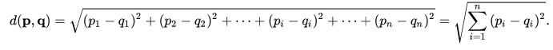
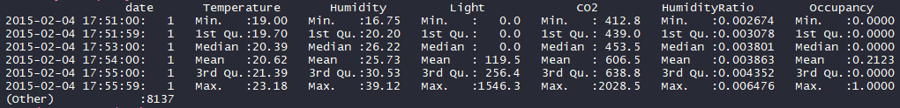
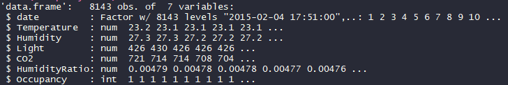
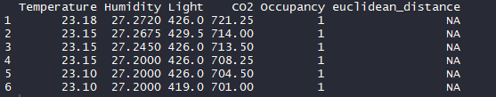
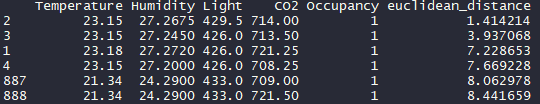

# Euclidean Distance on an Occupancy Detection dataset

The project consists of showing how to calculate Euclidean distance on an Occupancy Detection dataset.

# Getting Started

- Download [https://code.visualstudio.com/] or another alternative source-code editor of your preference
- Download the project on [https://github.com/taxenco/Euclidean_Distance_R].
- Go to your terminal and run the following command --> git clone https://github.com/taxenco/Euclidean_Distance_R
- Access to Visual Studio Code or another alternative source-code editor and open the project. Alternatively, you can access the project on through the terminal.
- Download R support for Visual Studio Code

# Prerequisites

- Visual Studio Code or another alternative source-code editor.
- Linux.
- R support for Visual Studio Code.
- Txt files.

# The objective of the project

This project will calculate the euclidean distance on an Occupancy Detection dataset for a query point. As well as illustrate how to inspect a dataset.  
Theory on Euclidean Distance

A Euclidean Distance[1][2] is one of the distance metrics along with many other such as Minkowski Distance, Cosine Distance, Mahalanobis Distance, and so on and forth. The distance metrics are a crucial component for many classifying Machine Learning algorithms.

The Euclidean distance is the L2-norm of the difference, a particular case of the Minkowski distance with p=2.

# Data

The data selected is a Occupancy Detection dataset. The data used was found on:

https://archive.ics.uci.edu/ml/datasets/Occupancy+Detection+
The dataset is made 6 decision variables and 1 class variable.

·         date time year-month-day hour: minute: second

·         Temperature, in Celsius

·         Relative Humidity, %

·         Light, in Lux

·         CO2, in ppm

·         Humidity Ratio, Derived quantity from temperature and relative humidity, in kgwater-vapor/kg-air

·         Occupancy, 0 or 1, 0 for not occupied, 1 for occupied status

# Data cleaning

The dataset is already cleaned, and it is ready for performing the decision tree.

Calculating Euclidean Distance

This section will show how to calculate Euclidean Distance an Occupancy Detection dataset.
 
Let ‘s start inspecting the dataset:
 
* Five-number summary

* Data-frame
 

 
As we can see, the data is clean, even though there are some extreme values that in case of modelling, we could normalize.
To store the Euclidean Distances, we will create a new column, and we will insert NA as a value.
 

Now we can calculate the distances and insert them into the column created.

Finally, we can define the classes and query all the points and find out where they belong.
 
- Example 1 in the code:
 
Class 1 > = K
Class 2 < K
Query point à K= 2
The query point belongs to class 1 
 
- Example 2 in the code:

Class 1 > = K
Class 2 < K
Query point à K= 200
The query point belongs to class 0 

# Conclusion

Euclidean Distance is an excellent method to calculate distances and classify data points. Distances are a vital component of many algorithms such as k-nearest neighbours, clustering or natural language processing. 
 

The implementation of the Euclidean Distance has achieved its purpose of illustrating the process of calculating the distances and query a data point to figure out where it belongs

# References

* 1 - https://en.wikipedia.org/wiki/Euclidean_distance
* 2 - MSc Data science notes, Salford University. Euclidean Distance

# Built With

-  Linux - Operating system
- R programming language
- Txt files

# Author

Carlos Beltran.

# Acknowledgements

The author would like to thank Salford University.